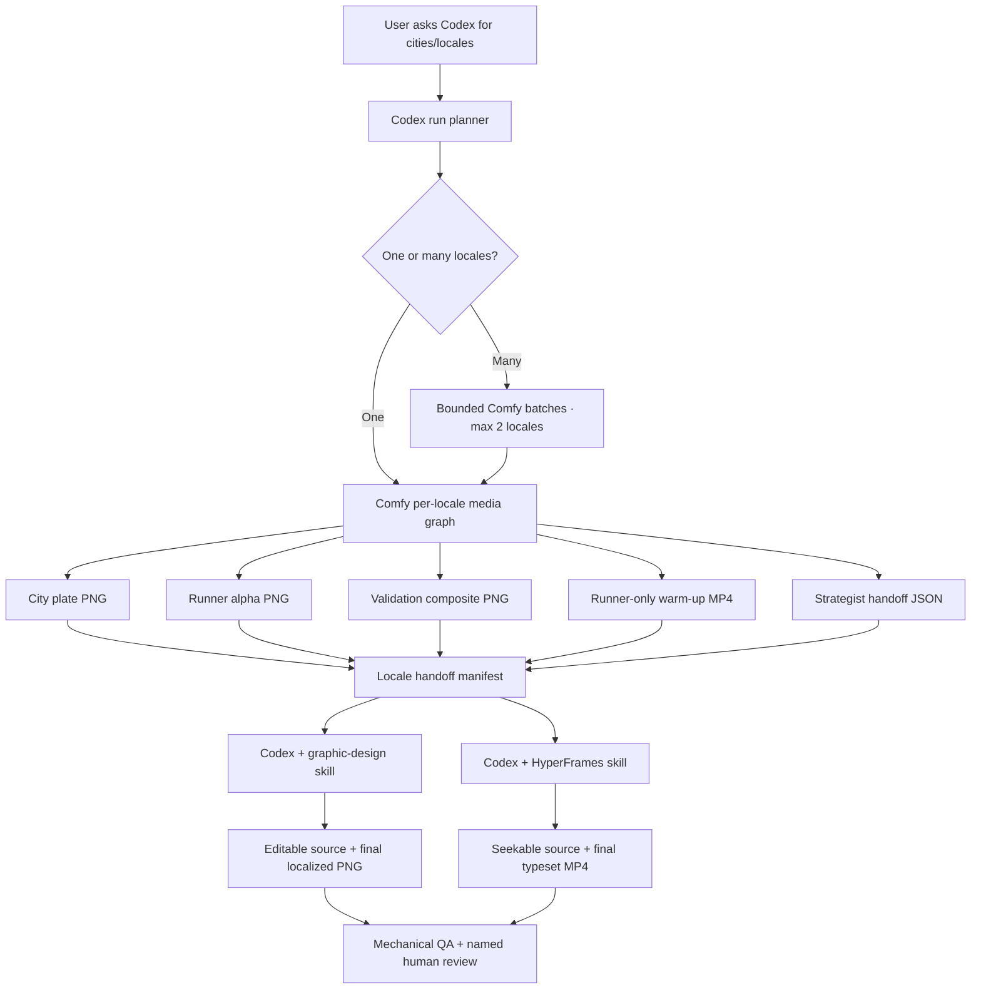

# LocaleFlow: Codex-orchestrated campaign localization

An interview prototype showing how a creative team can turn one campaign system into localized static
and motion deliverables without flattening every decision into a single image-model prompt.

The user works in **Codex**. Codex fans a locale list into a repeatable **Comfy** media graph, downloads
the original outputs, invokes the **graphic-design** skill for deterministic static finishing, and invokes
**HyperFrames** for deterministic motion typography.

The scaling story is deliberately simple: **one natural-language request containing a locale list can fan
out into hundreds of traceable media assets**. Twenty-five locales at eight media assets each is 200
deliverables, before manifests and QA records, without turning the workflow into twenty-five manual demos.

> Independent prototype. Not authorized, sponsored, or endorsed by Nike or Adobe. The included project
> references user-supplied campaign material. Do not publish trademarked assets, athlete likenesses, or
> generated derivatives without the necessary permissions.

## What the demo proves

- One city input becomes a structured landmark, casting, locale, exclusion, and review brief.
- Nano Banana Pro generates the skyline module and a new fictional runner in separate branches.
- Skyline planning uses a target-city landmark whitelist, explicitly erases the Seattle source silhouette,
  and reserves the far-left visibility zone so signature architecture survives the runner composite.
- Recraft creates an editable runner alpha.
- Kling 3.0 animates **only the isolated runner**.
- Bria attaches the locked city plate **after** Kling, protecting poster geometry from video drift.
- Comfy saves five media outputs plus one JSON handoff per locale.
- Codex invokes a graphic-design agent for exact localized copy and static export.
- Codex invokes a HyperFrames agent for staggered type, perimeter marquee, and final MP4.
- Multiple locales run as Codex-managed bounded batches with separate cost, retry, asset, and review records.

## Architecture



The Comfy graph is intentionally a per-locale unit. Codex owns multi-locale fan-out so every market has
its own prompt id, asset folder, retry boundary, provenance, and human-review state.

## Saved Comfy workflow

[Open the latest 28-node workflow in Comfy Cloud](https://cloud.comfy.org/#21f30a93-e0fb-43d3-a620-e2065174cec5)

The visible workflow contains:

1. One red `CITY INPUT · CHANGE ONLY THIS` node.
2. A Gemini localization strategist returning strict JSON.
3. Separate skyline and fictional-runner Nano Banana Pro branches.
4. Recraft background removal and explicit alpha handling.
5. Static city, runner, and composite outputs.
6. Kling 3.0 receiving only the isolated runner.
7. Bria recompositing the moving runner over the locked city plate.
8. MP4 output and JSON agent-handoff output.
9. Three completed reference-poster previews for interview presentation.

The saved graph is for inspection and single-city demos. Codex uses
`workflows/nano-banana-pro-full-localizer.api.json` as the batchable execution unit.

The exact latest editor graph is also checked in as
`workflows/nike-run-localizer-codex-orchestrated-multi-locale-latest.json` so it can be inspected, versioned,
or imported without relying on a cloud link.

The current skyline contract requires the primary landmark in the far-left 3–22% of the crop and a continuous
bottom-anchored skyline through at least 72% of its width. Landmark names are a closed whitelist; the original
Seattle skyline and Space Needle must be erased for every non-Seattle locale.

## Output contract

| Node | Output | Downstream owner |
|---:|---|---|
| 9 | localized city plate PNG | graphic-design |
| 15 | fictional runner PNG with alpha | graphic-design |
| 17 | Comfy validation composite PNG | graphic-design + QA |
| 18 | raw runner PNG | anatomy/casting review |
| 21 | runner warm-up over locked plate MP4 | HyperFrames |
| 22 | strategist JSON | both agents + review |

The machine-readable contract is [contracts/handoff.schema.json](contracts/handoff.schema.json).

## Quick start

### 1. Prerequisites

- Node.js 22+
- FFmpeg
- Codex desktop/CLI signed in
- Comfy Cloud connector available in Codex
- A Comfy account with credits for paid partner nodes
- Local `graphic-design` and `hyperframes` skills

Install project dependencies:

```bash
npm install
```

### 2. Supply cleared inputs

Provide a protected campaign background and pose/wardrobe runner reference. Upload them to your own Comfy
workspace and replace the two `LoadImage` values. The hashes in the checked-in graph belong to the original
workspace and are not portable credentials or public assets.

Do not commit third-party brand assets or identifiable-person media until publication rights are cleared.

### 3. Ask Codex — this is the primary interface

Open the repository in Codex and use a prompt such as:

> Localize this campaign for Paris, London, and Tokyo. Run the Comfy workflow for every locale, then
> finish the static posters with the graphic-design skill and the motion posters with HyperFrames. Show
> me the spend estimate before paid generation and do not stop at previews.

Codex resolves the cities, creates the run plan, submits the Comfy batch, collects the assets, and drives
both finishing stages. The user does not need to open a terminal or manually move files between tools.

For audit or automation testing, the free planning step can also be run directly:

```bash
npm run pipeline:plan -- --locales paris-fr,london-en,tokyo-ja
```

This creates:

```text
runs/<run-id>/
  run.json
  paris-fr/handoff.json
  london-en/handoff.json
  tokyo-ja/handoff.json
```

Planning is free and does not submit Comfy jobs.

Codex will then:

1. clone the API graph for each locale;
2. set the city and locale-specific output prefixes;
3. use bounded Comfy batch calls of at most two full graphs, waiting between batches;
4. wait for terminal completion;
5. download and checksum original outputs;
6. complete each handoff manifest;
7. invoke [agent-prompts/graphic-design.md](agent-prompts/graphic-design.md);
8. invoke [agent-prompts/hyperframes.md](agent-prompts/hyperframes.md);
9. keep automated PASS states separate from human REVIEW states.

## Static finishing

The graphic-design agent receives the city plate, runner alpha, validation composite, strategist JSON,
and locale record. It preserves official marks and protected geometry, then adds copy as editable HTML/SVG.
It exports a native-ratio sRGB PNG, source, provenance, and QA package.

Final typography is never entrusted to the image generator.

## Motion finishing

The HyperFrames agent receives the Comfy MP4 and the completed static design tokens. It treats the MP4 as
a frozen media plate, then adds:

- staggered localized headline animation;
- supporting-line entrance;
- finite, seek-safe Six Caps perimeter marquees;
- disclosure/location text;
- checked proof snapshots and final encoding.

The current New York reference project lives in
`videos/nrc-localized-motion-poster/`. Its verified final reference render is
`videos/nrc-localized-motion-poster/renders/new-york-motion-poster.mp4`.

## Included Codex skills

The repo contains three project-local skills under `.agents/skills/`:

- `nrc-campaign-localizer` turns one locale-list request into independent Comfy jobs and routes outputs;
- `nrc-static-finisher` rebuilds editable, deterministic static typography from the Comfy layers;
- `nrc-motion-finisher` preserves the approved static design while animating only the isolated human and type reveals.

They are intentionally specific to this production contract and can be used as the basis for an Adobe
Firefly Graph implementation.

## Cost and retry behavior

The current five-second per-locale graph includes paid Gemini, Nano Banana Pro, Recraft, Kling 3.0, and
Bria nodes. Prices change; Codex must use the live estimator and obtain explicit approval before submission.

- Never rerun a paid job because a download failed.
- Never rerun Kling because HyperFrames failed.
- Retry only the failed locale and smallest failed stage.
- A provider 429 gets one retry after a 60-second backoff; successful sibling locales are never rerun.
- A submitted prompt is not a completed output; terminal job or batch status is required.

## QA and governance

Automated checks cover file existence, dimensions, duration, color mode, alpha presence, graph references,
and checksums. These remain human decisions:

- native-language copy and tone;
- landmark accuracy;
- cultural specificity;
- casting and representation;
- anatomy and resemblance;
- brand and legal approval;
- source, trademark, and likeness rights.

The JSON handoff keeps those states visible instead of calling a market “approved” because generation ran.

The latest real production regression covered Mexico City, Sydney, and Shanghai. It found and fixed provider
concurrency, output isolation, generated-accessory, and motion-branding defects. See the
[three-locale QA report](review/locale-qa-2026-08-08.md) for the final media evidence and review gates.

## Repository map

```text
AGENTS.md                     Codex operating contract
PIPELINE.md                   system boundary and lifecycle
config/                       public pipeline configuration
contracts/                    handoff schema
agent-prompts/                static and motion stage guidance
data/localizations.json       draft market records
workflows/                    Comfy API graphs
scripts/                      graph builders, run planner, QA
composition/                  deterministic static source
presentation/                 interview explainer site
videos/                       HyperFrames motion projects
runs/                         generated run state; ignored by git
```

## Local verification

```bash
npm run build:workflow
npm run validate:workflow
npm test
npm run proof
```

The presentation can be served from any static server rooted at the repository.

## Publishing this repository

Read [PUBLICATION_CHECKLIST.md](PUBLICATION_CHECKLIST.md) before making the GitHub repository public.
The code, workflow topology, prompts, schemas, and documentation can be published independently of
restricted campaign media. This repository intentionally ignores run outputs and user-supplied source assets
by default.

No open-source license is asserted for third-party marks, photographs, likenesses, generated derivatives,
or supplied campaign art.
