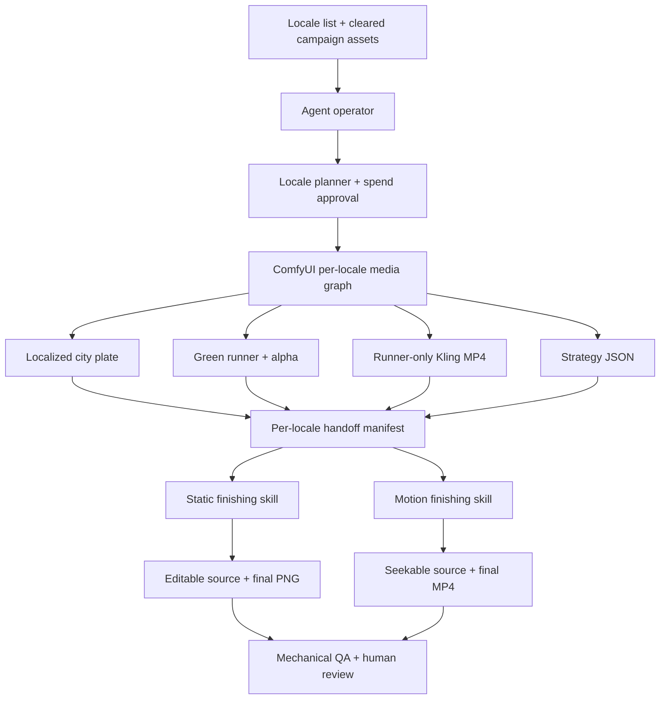

# LocaleFlow: agent-operated campaign localization

LocaleFlow turns a list of cities or locales into traceable static and motion campaign assets. An agent
orchestrates a reusable ComfyUI graph, collects its media layers, finishes typography and layout
deterministically, and preserves a reviewable handoff for every market.

The system is designed for creative teams that want the speed of generative media without asking an image
or video model to reproduce final typography, brand geometry, or legal copy.

> This repository is an independent workflow implementation. Replace the included reference material with
> assets your team is authorized to use. No rights are granted to third-party marks, photographs, likenesses,
> or generated derivatives.

## What it produces

For each locale, the pipeline produces:

- a localized city plate;
- a newly generated fictional runner on a controlled green background;
- a transparent runner layer and a validation composite;
- a runner-only warm-up animation generated by Kling;
- an editable static poster with deterministic localized typography;
- a motion poster with the same approved layout and animated typography;
- a manifest containing prompts, model provenance, file checksums, and QA states.

One request can contain one locale or a long locale list. The agent fans that request into independent Comfy
jobs so each market retains its own cost record, retry boundary, artifacts, and approval state.

## System architecture



ComfyUI owns variable media generation. The agent owns locale fan-out, files, provenance, and retries. The
static finisher owns exact type and layout. The motion finisher animates the approved design while keeping the
generated runner isolated from the protected poster plate.

## Included workflows

| Purpose | File | Use |
|---|---|---|
| Editable ComfyUI graph | [nike-run-localizer-codex-orchestrated-multi-locale-latest.json](workflows/nike-run-localizer-codex-orchestrated-multi-locale-latest.json) | Import into ComfyUI to inspect, edit, or run one locale |
| API execution graph | [nano-banana-pro-full-localizer.api.json](workflows/nano-banana-pro-full-localizer.api.json) | Clone once per locale for agent-controlled batch execution |
| Workflow manifest | [manifest.json](workflows/manifest.json) | Stable machine-readable pointers and output-node contract |

The editable graph contains one prominent `CITY INPUT · CHANGE ONLY THIS` field. That value drives a Gemini
strategy node, separate Nano Banana Pro skyline and character branches, chroma extraction, static compositing,
Kling runner animation, Bria green-screen normalization, and a JSON handoff.

The cloud copy can be opened at
[Comfy Cloud workflow 21f30a93-e0fb-43d3-a620-e2065174cec5](https://cloud.comfy.org/#21f30a93-e0fb-43d3-a620-e2065174cec5).
The checked-in JSON is the portable source of truth.

See [workflows/README.md](workflows/README.md) for the node map, import instructions, required partner nodes,
and output contract.

## Included agent skills

The repository contains project-local skills in `.agents/skills/`:

| Skill | Responsibility |
|---|---|
| `locale-flow-operator` | Routes the full request from locale planning through Comfy, finishing, and QA |
| `nrc-campaign-localizer` | Executes the per-locale Comfy graph and collects original outputs |
| `nrc-static-finisher` | Rebuilds editable localized typography and exports the final static poster |
| `nrc-motion-finisher` | Animates the approved poster using the isolated runner video and deterministic type |

When this repository is opened in Codex, the local skills and [AGENTS.md](AGENTS.md) provide the operating
contract. Other agent environments can copy these skill folders into their supported skills directory or
adapt their instructions to the environment's tool format.

The stage skills can use a general graphic-design capability and HyperFrames when those are available. The
repository's own instructions remain the source of truth for layer ownership, asset paths, and completion
criteria. See [.agents/skills/README.md](.agents/skills/README.md) for installation and routing details.

## Requirements

- Node.js 22 or later
- FFmpeg
- a ComfyUI or Comfy Cloud environment that supports the nodes listed in [workflows/README.md](workflows/README.md)
- credits for the selected paid partner nodes
- an agent with filesystem access and a Comfy connector or API integration
- a deterministic HTML/SVG rendering capability for static finishing
- HyperFrames for the supplied motion-finishing implementation

Install the repository dependencies:

```bash
npm install
```

If HyperFrames is not already available to the agent, install its skills using the current HyperFrames CLI:

```bash
npx hyperframes skills
```

Keep credentials in the agent or Comfy credential store. Do not add API keys or access tokens to this repo.

## Setup

1. Import the [editable workflow](workflows/nike-run-localizer-codex-orchestrated-multi-locale-latest.json)
   into your Comfy workspace.
2. Upload a cleared protected campaign plate and a cleared character/wardrobe reference on a uniform green
   background.
3. Replace the two `LoadImage` values in the imported graph with your workspace assets.
4. Confirm the graph's partner nodes and model selections are available in your account.
5. Copy [config/pipeline.example.json](config/pipeline.example.json) to your private runtime configuration if
   you need different concurrency, workflow IDs, or retry behavior.
6. Add or update locale records in [data/localizations.json](data/localizations.json). Treat copy as draft
   until a native-language reviewer approves it.
7. Open the repository in your agent and ask it to use `locale-flow-operator`.

The full environment and import process is documented in [docs/SETUP.md](docs/SETUP.md).

## Give this request to your agent

```text
Use the locale-flow-operator skill in this repository.

Localize the supplied campaign for Cairo, Rio de Janeiro, and San Francisco. First validate the locale
records and show me the estimated paid Comfy cost. After I approve the spend, run the canonical Comfy
workflow for every locale, download and checksum all original outputs, finish the static posters, finish
the motion posters, run mechanical QA, and leave language, cultural, casting, landmark, brand, and rights
checks clearly marked for human review. Do not stop at Comfy previews.
```

The agent should create a run plan before submitting paid work:

```bash
npm run pipeline:plan -- --locales cairo-ar,rio-pt,san-francisco-en
```

Planning is local and does not submit Comfy jobs. Generated run state is written under `runs/<run-id>/` and
is ignored by git.

## Per-locale output contract

| Comfy node | Artifact | Consumer |
|---:|---|---|
| 9 | localized city plate PNG | static finisher |
| 15 | fictional runner PNG with alpha | static finisher |
| 17 | validation composite PNG | static finisher and QA |
| 18 | raw generated runner PNG | casting and anatomy review |
| 21 | green-screen runner warm-up MP4 | motion finisher |
| 22 | strategist JSON | both finishers and review |

The complete handoff contract is [contracts/handoff.schema.json](contracts/handoff.schema.json). A locale is
not complete until Comfy reaches terminal success, original outputs are downloaded, checksums are recorded,
both finishing stages produce their declared artifacts, and review states are explicit.

## Operating rules

- Request explicit approval before any paid Comfy submission.
- Run no more concurrent locales than the configured batch limit.
- Retry only the failed locale and smallest failed stage.
- Never rerun a paid model because a download or downstream finishing step failed.
- Do not ask generative models to create final typography, addresses, legal copy, or brand marks.
- Do not pass the complete poster through Kling. Animate only the isolated green-screen runner.
- Reuse the approved static coordinates and strings in motion; animation may reveal the design, not redesign it.
- Keep automated checks separate from language, culture, casting, landmark, brand, legal, and rights approval.

The exact lifecycle is documented in [docs/AGENT_OPERATIONS.md](docs/AGENT_OPERATIONS.md) and summarized in
[PIPELINE.md](PIPELINE.md).

## Adapting the system

The included reference implementation uses a fixed campaign plate, localized skyline module, fictional
runner, and deterministic typography. To adapt it for another campaign:

1. identify which layers are protected and which may vary;
2. replace the cleared source assets in Comfy;
3. update the strategist system prompt and locale records;
4. update the static composition and its design tokens;
5. keep the handoff schema and per-locale provenance model;
6. regenerate and validate the API workflow after changing the editor graph;
7. test one locale before authorizing a batch.

This separation is the core pattern: generative tools create bounded media layers, while deterministic tools
finish copy, typography, brand geometry, and delivery formats.

## Validation

```bash
npm run build:workflow
npm run validate:workflow
npm test
npm run qa
```

`npm run proof` runs the complete local validation and rendering sequence. It can be slower because it rebuilds
reference media.

## Repository map

```text
.agents/skills/                agent-operable workflow skills
agent-prompts/                 stage handoff guidance
config/                        public runtime configuration example
contracts/                     machine-readable handoff schema
data/                          locale records and deterministic copy
docs/                          setup and agent operations manuals
workflows/                     editable and API ComfyUI graphs
scripts/                       graph builders, planner, rendering, and QA
composition/                   deterministic static composition source
videos/                        HyperFrames motion composition source
review/                        reference QA records and regression evidence
runs/                          local generated run state; ignored by git
```

## Reference assets and rights

Some checked-in files document a reference implementation built from user-supplied campaign material. They
are included to make the workflow understandable and testable, not to grant production or publication rights.
Before using this system commercially, replace those inputs with cleared assets and complete your
organization's brand, legal, privacy, and likeness review.
