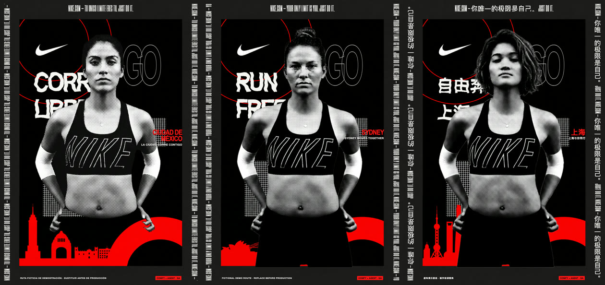
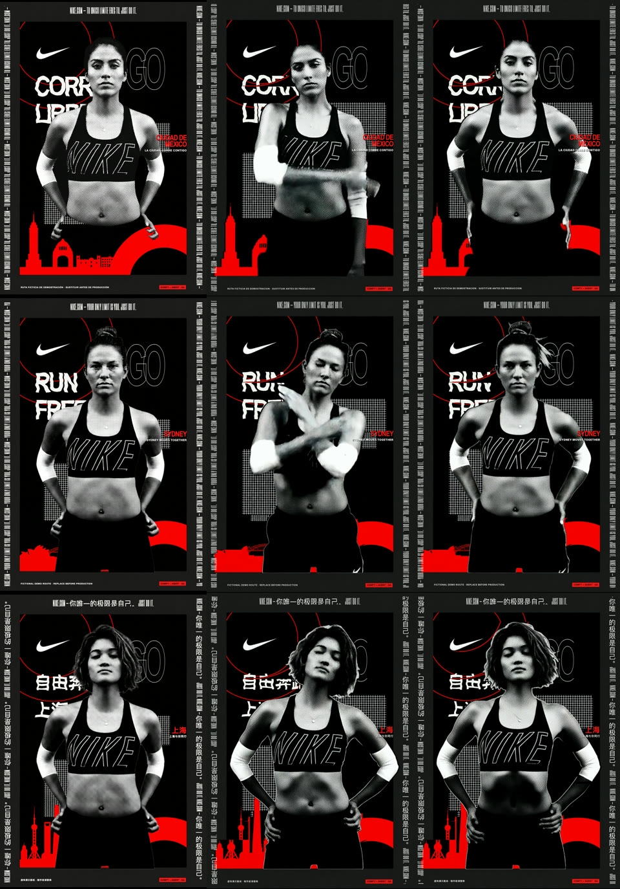

# Three-locale production QA

**Run date:** 2026-08-08  
**Locales:** Mexico City (`es-MX`), Sydney (`en-AU`), Shanghai (`zh-CN`)  
**Result:** PASS with named human-review gates  
**Workflow:** [Comfy Cloud canvas, saved version 4](https://cloud.comfy.org/#21f30a93-e0fb-43d3-a620-e2065174cec5)

The left, middle, and right columns below show the approved static, a mid-motion frame, and the settled
motion frame for each locale.

## What was exercised

Each city ran through the paid production path: city strategist, separate Nano Banana Pro skyline and
fictional-runner branches, alpha extraction, static composite, Kling 3.0 runner-only motion, Bria locked-plate
recomposite, JSON handoff, and deterministic localized static finishing.

The final approved outputs for every locale satisfy these mechanical checks:

- city plate and validation composite: `1055 x 1491`;
- runner asset: `864 x 1232` RGBA with real transparent, opaque, and feathered pixels;
- motion plate: H.264, `1204 x 1720`, 24 fps, 5.041667 seconds;
- protected pixels outside the skyline crop: zero changes across 1,364,955 checked pixels;
- bottom-left skyline fill through the protected 72% zone: at least 99.8%;
- green-screen residuals in validation composites: zero detected pixels;
- poster background remains effectively static across sampled motion frames;
- each runner is a newly generated fictional person rather than a recolor of the source.

## Bugs found and fixed

| ID | Observed failure | Fix | Regression evidence |
|---|---|---|---|
| ISSUE-001 | Three full paid graphs submitted together triggered a provider 429 for Shanghai. | Limit full-graph concurrency to two locales, wait 60 seconds, retry only the failed locale once. | Batch policy is enforced in config and tests. |
| ISSUE-002 | The 28-node presentation canvas emitted three unrelated reference previews during production runs. | Codex now runs the isolated 22-node execution graph; the 28-node canvas remains the visual interview graph. | Test asserts exactly six locale deliverables and no `PreviewImage` outputs. |
| ISSUE-003 | Shanghai runner generation invented a branded headband with city and club lettering. | Lock the supplied wardrobe and prohibit headwear, accessories, city names, club copy, and all generated lettering except the supplied NIKE treatment. | Runner-only partial retry passed visual review; prompt contract is tested. |
| ISSUE-004 | Kling invented a white swoosh on the lower garment during animation. | Require a solid-black unbranded lower garment and explicitly forbid new swooshes, shorts logos, emblems, stripes, and highlights. | Kling-plus-Bria partial retry passed frame-strip review; motion contract is tested. |
| ISSUE-005 | CJK styling was attached to a subcomposition root, which HyperFrames cannot safely scope during render. | Attach CJK sizing directly to the headline and city-lockup elements. | Shanghai lint/check now passes with 27/27 contrast checks. |
| ISSUE-006 | Mexico City's motion lockup was forced onto one line while the approved static wraps it across two. | Remove the motion-only `white-space` constraint and rerender only Mexico City. | Static/mid/final contact sheet confirms matching wrap and placement. |
| ISSUE-007 | Rerendering one failed locale replaced the motion manifest with only that locale. | Merge each partial render result into the existing manifest by locale id. | Regression test asserts merge and stable locale ordering. |

The fixes are recorded in commits `3128123`, `1c07eeb`, `b781985`, `ac8f82e`, `d982c5c`, `23b0823`,
and `967fec2`.

## Locale review notes

| Locale | Skyline evidence | Runner and motion | Status |
|---|---|---|---|
| Mexico City | Torre Latinoamericana and Monumento a la Revolucion are recognizable at the far-left edge; no Seattle landmark leakage. | Distinct fictional runner; apparel and background remain locked in motion. | Mechanical PASS; Spanish copy and landmark depiction require local human approval. |
| Sydney | Opera House and Harbour Bridge read at the left edge; no Seattle landmark leakage. | Distinct fictional runner; apparel and background remain locked in motion. | Mechanical PASS; landmark silhouette and Australian copy require local human approval. |
| Shanghai | Oriental Pearl Tower and Shanghai Tower read at the left edge; no Seattle landmark leakage. | Distinct fictional runner; headband text removed; final motion contains no added shorts logo. | Mechanical PASS; Chinese copy and the additional city-correct tower silhouette require local human approval. |

## Delivery evidence

- Unit and workflow tests: 9/9 passing.
- Production graph: 22 executable nodes and exactly six outputs per locale.
- Visible interview graph: 28 nodes, saved as version 4 in Comfy Cloud.
- Presentation page: HTTP 200; 32 same-origin asset links checked with zero failures.
- Responsive presentation: visually checked at desktop and 500-pixel viewport widths.
- Final HyperFrames outputs: H.264, `1204 x 1720`, 24 fps, 5.041667 seconds for all three locales.
- Final static checksums:
  - Mexico City: `ea2041bec71e988f7c551c4fc94e2ba48180525d5ed1333e0e21d9dd943aff36`
  - Sydney: `2d66cc62089d0e0c94bd28f0c74d307b66bf8f45308c97f19a46b3310e47cfce`
  - Shanghai: `ef1db4a8a62941147a3a70eaa0ca6a31b259cbbffeafa73ead88e13a358a90b3`
- Final motion checksums:
  - Mexico City: `3a76d955a22fec500447b3a05616b56cc96b84ad60efafc0d1922538634db3c7`
  - Sydney: `9de76702c8e2942a25621de4041525fdecdde7c3900f997d4cc2ac6c3e05bbb3`
  - Shanghai: `67cdea76b217f4410c82641dff618833453ea22fa045f6e04d9a2b0190350391`

## Remaining human gates

This QA run does not approve native-language nuance, casting or cultural representation, brand/legal usage,
landmark rights, or likeness rights. Those remain explicit review states in the per-locale handoff rather than
being silently treated as automated passes.
